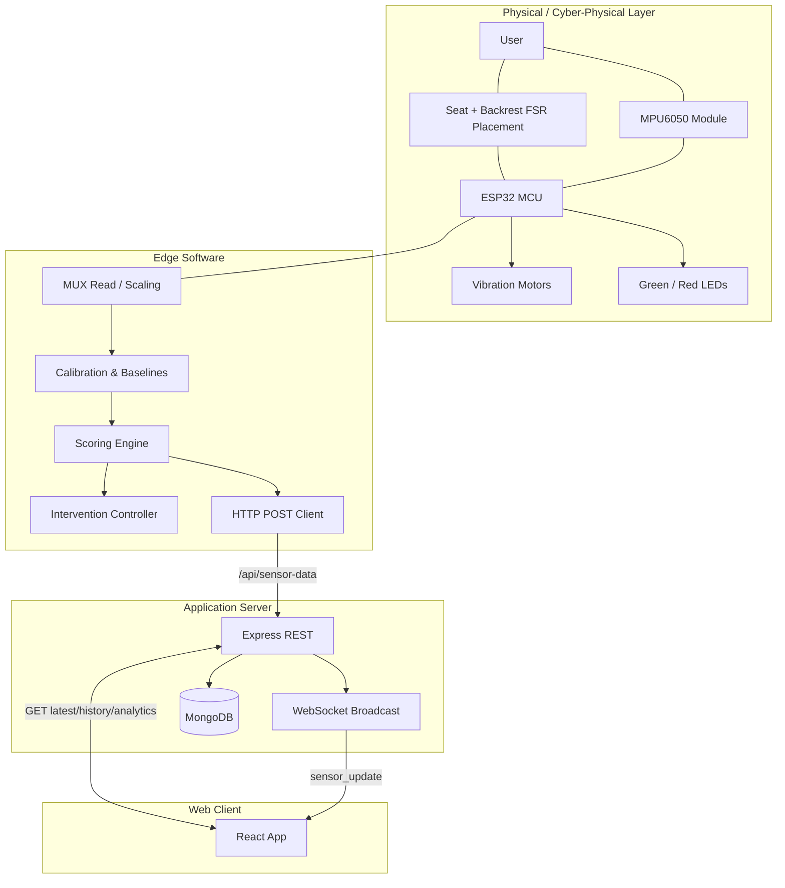
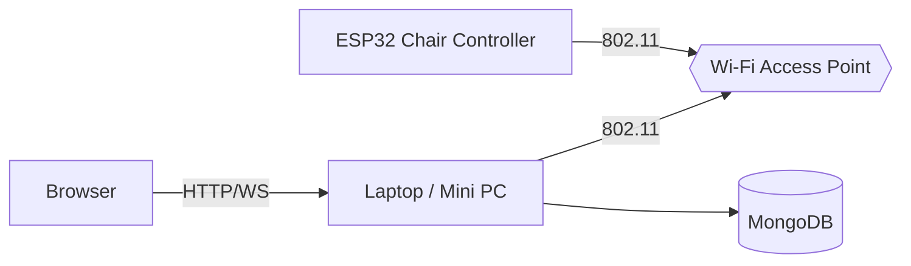
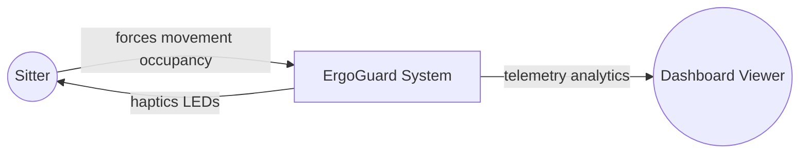
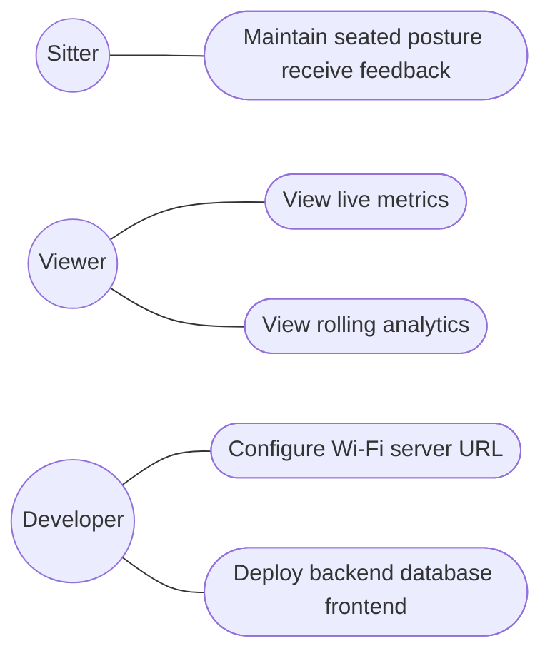
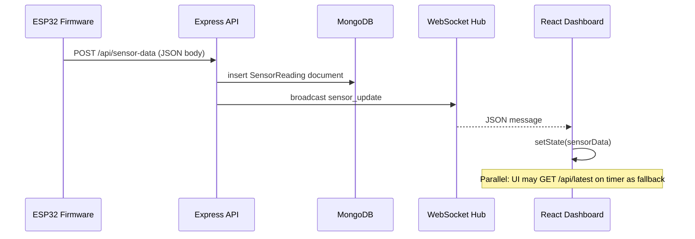
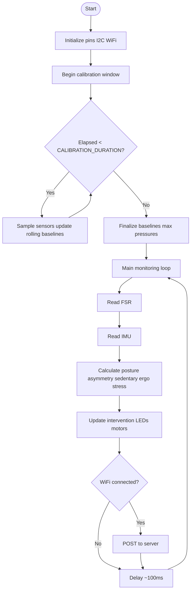
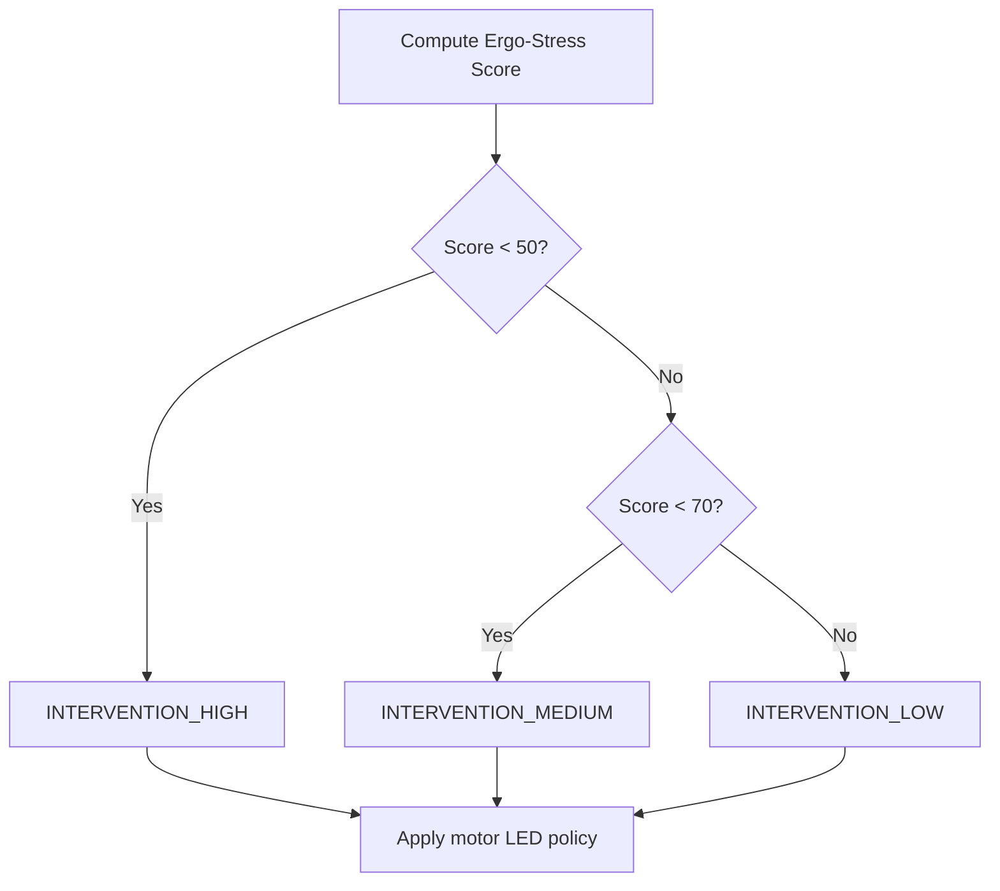
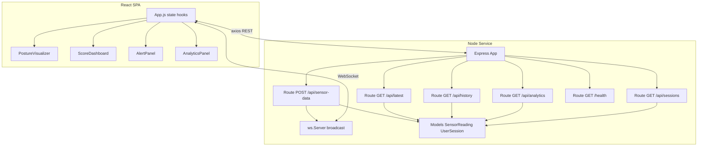
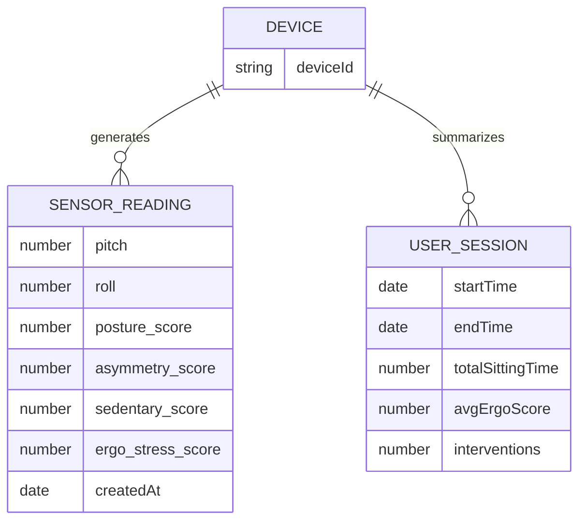

# ErgoGuard Chair — Comprehensive Technical Report  
### IoT-Based Ergonomic Monitoring with Real-Time Feedback and Web Analytics  

**Document type:** Project Report (Part I — System Study & Design)  
**Project:** ErgoGuard Chair  
**Repository path:** `ErgoGuard-Chair`  
**Primary artifact references:** `firmware/ergoguard_chair/ergoguard_chair.ino`, `backend/server.js`, `frontend/src/App.js`, `README.md`, `PROJECT_BLUEPRINT.md`  

---

## Document control

| Field | Value |
|--------|--------|
| Version | 1.0 |
| Intended audience | Academic submission, internal demo, stakeholder review |
| Diagram notation | Mermaid (paste into [mermaid.live](https://mermaid.live) for PNG/SVG export) |
| Scope note | This report describes the **implemented** 4‑FSR + MPU6050 firmware variant unless stated otherwise; blueprint sections mentioning 8 FSRs or environmental sensors are noted as roadmap vs. current build. |

---

# ABSTRACT

Ergonomic risk from prolonged sitting is a prevalent concern among **information technology professionals, software developers, and students** who remain seated for extended periods each day. Poor posture often develops gradually; without objective measurement, individuals receive feedback too late—after discomfort or fatigue has already accumulated. **ErgoGuard Chair** is an **Internet of Things (IoT)** system that embeds **pressure sensing**, **inertial orientation sensing**, and **adaptive haptic and visual feedback** directly in the seating environment. The system captures **force-sensitive resistor (FSR)** readings routed through a **16‑channel analog multiplexer** into a single **ESP32** analog pin, combines them with **MPU6050** accelerometer-derived **pitch and roll**, and executes a **calibration phase** to learn per-user baselines and approximate “personal maximum” pressure values for percentage-based presentation.

The firmware computes four complementary metrics: **posture score**, **asymmetry score** (weight distribution and backrest balance), **sedentary score** (time-based risk while seated), and a composite **Ergo-Stress score** produced by a **weighted penalty model** (posture 50%, asymmetry 20%, sedentary 30% in the current implementation). **Intervention policy** maps the Ergo-Stress score to **vibration motor** activity and **green/red status LEDs**, including a **sustained bad-posture** path that can **blink red** and hold vibration for clarity during demonstrations. Processed telemetry is transmitted over **Wi-Fi** using **HTTP POST** to a **Node.js** server built with **Express** and **Mongoose**, which persists documents in **MongoDB** and **broadcasts** each new reading to connected browsers through a **WebSocket** server colocated on the same HTTP port. A **React** single-page dashboard consumes **REST** endpoints for the latest sample and **rolling analytics**, and subscribes to **live `sensor_update` events** to refresh posture visualizations, score cards, alert panels, and 24‑hour summary statistics. A **polling fallback** (for example, every five seconds) improves robustness when the WebSocket path is unavailable.

The project is structured as a **three-tier software architecture** (embedded edge, application server, presentation client) on top of a **cyber-physical** chair assembly. It is suitable for **laboratory evaluation**, **capstone demonstration**, and **iterative product research**, with a documented path toward **multi-sensor expansion**, **user accounts**, **cloud hosting**, and **IDE- or mobile-integrated** experiences. This document provides the **system study, design, module breakdown, algorithms, testing strategy, and performance discussion** required for a formal report, with **architecture, data flow, UML-style use case, component, sequence, and flowchart** figures expressed in portable Mermaid notation.

**Keywords:** ergonomics, IoT, ESP32, FSR, MPU6050, sensor fusion, haptic feedback, Node.js, MongoDB, WebSocket, React, real-time dashboard.

---

# TABLE OF CONTENTS

1. [Introduction](#chapter-1-introduction)  
   1.1 Overview of the Project  
   1.2 Problem Statement  
   1.3 Objectives of the Project  
   1.4 Scope of the Project  
   1.5 Need for the Project  
   1.6 Expected Outcomes  
   1.7 Stakeholders and User Classes  
   1.8 Assumptions and Constraints  

2. [Literature Survey](#chapter-2-literature-survey)  
   2.1 Existing Systems and Commercial Landscape  
   2.2 Academic and Research Perspectives  
   2.3 Limitations of Existing Approaches  
   2.4 Proposed System Positioning  
   2.5 Comparative Study  

3. [System Analysis](#chapter-3-system-analysis)  
   3.1 Feasibility Study  
   3.2 Requirement Analysis  
   3.3 Functional Requirements  
   3.4 Non-Functional Requirements  
   3.5 User Requirements  
   3.6 System / Hardware / Software Requirements  
   3.7 Constraints and Dependencies  

4. [System Design](#chapter-4-system-design)  
   4.1 Design Goals  
   4.2 System Architecture  
   4.3 Deployment View  
   4.4 Data Flow Diagrams (Level 0 and Level 1)  
   4.5 Use Case Model (UML)  
   4.6 Sequence Diagram — Sample Upload and Live Dashboard  
   4.7 Flowcharts — Calibration, Main Loop, Intervention  
   4.8 UML Component Diagram — Software Modules  
   4.9 Database / Collection Design (MongoDB)  
   4.10 Interface Design — REST and WebSocket  

5. [Module Description](#chapter-5-module-description)  
   5.1 Hardware Layer — Sensors, Multiplexer, Actuators  
   5.2 Firmware — Sensor Acquisition and Calibration  
   5.3 Firmware — Scoring Engine  
   5.4 Firmware — Intervention and Actuation  
   5.5 Firmware — Communication (Wi-Fi and HTTP)  
   5.6 Backend — Persistence and Real-Time Broadcast  
   5.7 Backend — Analytics Aggregation  
   5.8 Frontend — Dashboard Composition  

6. [Algorithm and Pseudocode](#chapter-6-algorithm-and-pseudocode)  
   6.1 Posture Classification Logic  
   6.2 Asymmetry Metrics  
   6.3 Sedentary Logic (Demo-Oriented Timing)  
   6.4 Ergo-Stress Composition  
   6.5 Intervention State Machine  
   6.6 End-to-End Pseudocode  

7. [Implementation](#chapter-7-implementation)  
   7.1 Programming Languages and Runtimes  
   7.2 Tools and Libraries  
   7.3 Repository Layout and Key Files  
   7.4 Configuration — Firmware, Backend, Frontend  
   7.5 API Reference Summary  
   7.6 Representative Code References  
   7.7 Challenges Faced During Implementation  

8. [Output Screens and Results](#chapter-8-output-screens-and-results)  
   8.1 Expected Dashboard Panels  
   8.2 Qualitative Result Narrative  
   8.3 Interpreting Analytics  

9. [Testing](#chapter-9-testing)  
   9.1 Testing Strategy  
   9.2 Sample Test Cases  
   9.3 Unit, Integration, and System Testing Notes  

10. [Performance Evaluation](#chapter-10-performance-evaluation)  
    10.1 Latency and Refresh Rates  
    10.2 Accuracy and Limitations of Heuristic Scoring  
    10.3 Robustness and Failure Modes  

11. [Future Enhancement](#chapter-11-future-enhancement)  

12. [Conclusion and References](#chapter-12-conclusion-and-references)  

**Appendices**  
Appendix A — Pin Mapping Table  
Appendix B — JSON Payload Field Inventory  
Appendix C — List of Figures  
Appendix D — List of Tables  

---

# LIST OF TABLES (preview)

| Table ID | Title |
|-----------|--------|
| 2.1 | Comparative study summary |
| 3.1 | Functional requirements traceability |
| 3.2 | Non-functional requirements |
| 4.1 | REST endpoints |
| 4.2 | MongoDB collections and purposes |
| 7.1 | Repository file roles |
| 9.1 | Sample test cases |
| A.1 | ESP32 pin assignment |

---

# ABBREVIATIONS

| Abbrev. | Expansion |
|---------|------------|
| ADC | Analog-to-Digital Converter |
| API | Application Programming Interface |
| COM | Component Object Model (not used here); **context:** serial COM port in tooling |
| CPS | Cyber-Physical System |
| DFD | Data Flow Diagram |
| ER | Entity–Relationship |
| FSR | Force-Sensitive Resistor |
| HTTP(S) | Hypertext Transfer Protocol (Secure) |
| IMU | Inertial Measurement Unit |
| IoT | Internet of Things |
| JSON | JavaScript Object Notation |
| LAN | Local Area Network |
| LED | Light-Emitting Diode |
| MCU | Microcontroller Unit |
| MUX | Analog Multiplexer |
| REST | Representational State Transfer |
| SPA | Single-Page Application |
| SPI / I²C | Serial Peripheral Interface / Inter-Integrated Circuit |
| TLS | Transport Layer Security |
| UI / UX | User Interface / User Experience |
| URI | Uniform Resource Identifier |
| UML | Unified Modeling Language |
| WS | WebSocket |

---

# CHAPTER 1 — INTRODUCTION

## 1.1 Overview of the Project

**ErgoGuard Chair** is a **smart seating ergonomics platform** that treats the chair not merely as furniture but as a **sensor-rich edge device** in a distributed software system. The physical assembly includes an **ESP32** microcontroller, multiple **FSR** sensors placed to distinguish seat and backrest loading patterns, an **MPU6050** six-axis inertial module for tilt estimation, and **actuators** (two vibration motors and discrete green/red LEDs) that complete a **closed feedback loop** between sensed behavior and user-perceptible cues.

The software stack spans three layers:

1. **Embedded firmware** (`firmware/ergoguard_chair/ergoguard_chair.ino`) executed on the ESP32. It performs **continuous sampling**, **calibration**, **classification of posture states**, **numeric scoring**, **intervention control**, and **HTTP uploads** of structured JSON payloads.

2. **Application server** (`backend/server.js`) implemented with **Express.js**. It exposes REST endpoints, connects to **MongoDB** through **Mongoose**, and attaches a **WebSocket** server to the same underlying **HTTP** server instance so browser clients receive **push notifications** whenever new telemetry arrives.

3. **Presentation client** (`frontend/src/`) implemented with **React**. It retrieves historical aggregates and the latest stored reading through REST, opens a WebSocket to the backend host, and renders modular visualization components such as **PostureVisualizer**, **ScoreDashboard**, **AlertPanel**, and **AnalyticsPanel**.

The **PROJECT_BLUEPRINT.md** document articulates a broader product vision—including optional environmental sensing (for example, CO₂ and temperature) and richer actuator modalities—while the **currently shipped prototype** (documented in **README.md**) intentionally simplifies hardware to **four FSR channels**, **two discrete LEDs**, and **two motor channels**, ensuring reproducibility for academic labs and constrained budgets.

## 1.2 Problem Statement

Desk workers commonly exhibit:

- **Forward head and rounded shoulders** due to screen-focused tasks.  
- **Asymmetric loading** when leaning on one armrest or crossing legs, shifting seat pressure.  
- **Prolonged static posture** with insufficient micro-movements and breaks.  

Traditional interventions rely on **periodic reminders** from applications or wearables. Such reminders are **not tightly coupled** to actual seated posture or seat-specific mechanics. Moreover, wrist-worn devices cannot directly observe **seat pressure distribution** or **continuous backrest engagement**.

ErgoGuard Chair targets the gap by answering:

> “What does the **chair** measure about how I am sitting **right now**, and how can the system **help me correct course** before discomfort escalates—while **logging history** for reflection?”

## 1.3 Objectives of the Project

The primary objectives include:

1. **Objective sensing** — Capture quantitative proxies for posture using **pressure maps** (via strategically placed FSRs) and **torso tilt** via MPU6050-derived angles.  
2. **Personalization** — Perform an **automatic calibration window** (approximately one minute in the delivered firmware) so baselines adapt to user morphology without manual knob tuning in ordinary operation.  
3. **Explainable metrics** — Produce interpretable scores for **posture**, **asymmetry**, **sedentary risk**, and an overall **Ergo-Stress** score suitable for dashboard visualization.  
4. **Immediate feedback** — Drive **LED** and **vibration** outputs locally so feedback remains tangible even if network connectivity degrades.  
5. **Connectivity** — Transmit readings to a backend for **longitudinal study**, demonstration to evaluators, and integration with analytics pipelines.  
6. **Live visualization** — Provide a **browser dashboard** with low-latency updates using WebSockets and resilient polling.  
7. **Educational clarity** — Maintain readable code and documentation so the project can serve as a teaching artifact for embedded systems, web backends, and IoT integration.

## 1.4 Scope of the Project

**Included:**

- Hardware prototype wiring assumptions documented in **README.md** (MUX-based analog routing, I²C IMU, GPIO-driven motors and LEDs).  
- Firmware scoring and intervention consistent with `ergoguard_chair.ino`.  
- Backend schemas embedded in `server.js` for **sensor readings** and **user sessions**.  
- Frontend dashboard integration and REST/WebSocket usage as implemented in `App.js`.

**Excluded / roadmap (not claimed as fully delivered unless separately verified):**

- Production-grade security (TLS termination, authentication, tenant isolation).  
- Large-scale cloud deployment, MQTT clustering, or fleet provisioning portals.  
- Clinical validation or medical-device compliance.  
- Full eight-sensor spatial layouts from early blueprints unless physically implemented.

## 1.5 Need for the Project

Educational institutions and innovation labs require **tangible IoT demonstrations** that combine **physics**, **embedded programming**, **networking**, and **full-stack web engineering**. ErgoGuard Chair satisfies this need while addressing a **relatable wellness narrative**. For workplaces, even a non-medical prototype can **raise awareness** and **support pilot studies** that correlate subjective comfort logs with objective seat metrics.

## 1.6 Expected Outcomes

Upon successful integration and testing, the project is expected to demonstrate:

- Stable **Wi-Fi connectivity** and reproducible **HTTP ingestion** into MongoDB.  
- **Live dashboard updates** upon each accepted POST.  
- Observable correlation between **deliberate posture changes** (forward lean, upright engaged sit) and changes in **scores** and **alert messaging**.  
- **Analytics summaries** over configurable windows (for example, **24 hours** via query parameter).  
- A compelling **demo script** for judges or sponsors (see README “Demo Script” section).

## 1.7 Stakeholders and User Classes

| User class | Goals |
|------------|--------|
| **Seated user (“sitter”)** | Receive timely tactile/visual cues; reduce harmful sitting habits. |
| **Dashboard viewer** | Observe live metrics during demos; review aggregate analytics. |
| **Developer / integrator** | Configure SSID, backend URL, Mongo URI; extend scoring or UI. |
| **Evaluator / instructor** | Assess engineering completeness, documentation, and experimental method. |

## 1.8 Assumptions and Constraints

- The ESP32 and workstation share a **routable LAN** during demos (typical classroom or home Wi-Fi).  
- MongoDB is reachable from the backend process (local instance or cloud URI in `.env`).  
- ADC readings are environment- and wiring-sensitive; thresholds in firmware are **tunable constants**.  
- The sedentary heuristic includes **demo-oriented time constants** (for example, penalties after a few minutes) to make behavior observable within short evaluation sessions.

---

# CHAPTER 2 — LITERATURE SURVEY

## 2.1 Existing Systems and Commercial Landscape

Commercial wellness products span **wearables**, **desk-mounted posture trainers**, and **smart cushion** concepts. Wearables estimate activity and sometimes infer posture using wrist kinematics, but they **do not directly measure seat pressure**. Desktop cameras can estimate pose but raise **privacy** and **lighting** concerns. Cushion-based systems conceptually align with ErgoGuard; differentiation lies in **transparent open-source implementation**, **explicit scoring methodology**, and **tight integration** with a **live web analytics stack** suitable for academic reproducibility.

## 2.2 Academic and Research Perspectives

Research in occupational ergonomics emphasizes **multi-modal sensing** (pressure + kinematics) for sedentary behavior inference. Studies often highlight **longitudinal data collection** and **context-aware prompts**. ErgoGuard aligns with these themes by combining **pressure asymmetry features** with **IMU tilt features**, storing time-series samples in a database for later statistical analysis.

## 2.3 Limitations of Existing Approaches

Common limitations include:

- **Fragmented tooling** — Measurements in hardware demos never reach a database; databases exist without live physical prototypes.  
- **Opaque scoring** — Commercial devices rarely disclose algorithms for peer review.  
- **Weak longitudinal UX** — Consumer apps may not expose raw timelines suitable for lab reporting.

## 2.4 Proposed System Positioning

ErgoGuard proposes an **end-to-end demonstrator**:

**Chair edge intelligence + REST ingestion + Mongo persistence + WebSocket live UX.**

## 2.5 Comparative Study

**Table 2.1 — Comparative summary**

| Criterion | Spreadsheet logging | Wearable reminder app | ErgoGuard Chair (this project) |
|-----------|---------------------|------------------------|--------------------------------|
| Seat pressure sensing | No | No | Yes (FSR via MUX) |
| Torso tilt sensing | No | Partial / indirect | Yes (MPU6050 pitch/roll) |
| Local haptic feedback | No | Sometimes | Yes (dual motors) |
| Open implementation | Yes | No | Yes (repository code) |
| Live web dashboard + DB | Manual | Varies | Yes (React + MongoDB) |

---

# CHAPTER 3 — SYSTEM ANALYSIS

## 3.1 Feasibility Study

### (a) Technical Feasibility

The chosen technologies are mature:

- **ESP32** supports Wi-Fi client mode and Arduino-compatible tooling.  
- **Node.js + Express** handle moderate IoT ingest rates for classroom-scale demos.  
- **MongoDB** document model fits heterogeneous telemetry payloads as firmware evolves.  
- **React** enables modular visualization.

### (b) Operational Feasibility

Users interact through **seating** (passive) and a **browser** (observation). Minimal training is needed for demos beyond plugging hardware and starting servers.

### (c) Economic Feasibility

Components remain within modest budgets (see blueprint cost estimates); software stacks are largely open-source.

### (d) Schedule Feasibility

Phased delivery maps cleanly to milestones: **hardware bring-up → firmware calibration/scores → backend persistence → frontend polish**.

## 3.2 Requirement Analysis

Requirements were derived from README promises, blueprint intent, and implemented APIs.

## 3.3 Functional Requirements

**Table 3.1 — Functional requirements (traceability)**

| ID | Requirement | Source module |
|----|-------------|----------------|
| FR-01 | Sample FSR channels via MUX | Firmware `readMuxChannel`, `readFSRSensors` |
| FR-02 | Sample MPU6050 and compute pitch/roll | Firmware `readIMU` |
| FR-03 | Run calibration window before monitoring | Firmware calibration phase in `loop()` |
| FR-04 | Compute posture, asymmetry, sedentary, Ergo-Stress | Firmware `calculate*` functions |
| FR-05 | Actuate LEDs/motors based on intervention policy | Firmware `updateIntervention` |
| FR-06 | POST JSON sensor payload to backend | Firmware HTTP client |
| FR-07 | Persist readings in MongoDB | Backend `POST /api/sensor-data` |
| FR-08 | Broadcast updates to WebSocket clients | Backend `broadcastToClients` |
| FR-09 | Fetch latest reading and analytics | Backend `GET /api/latest`, `/api/analytics` |
| FR-10 | Render dashboard with live updates | Frontend `App.js` + components |

## 3.4 Non-Functional Requirements

**Table 3.2 — Non-functional requirements**

| ID | Category | Requirement |
|----|----------|---------------|
| NFR-01 | Performance | Firmware loop ~10 Hz (`delay(100)`); backend must accept periodic POSTs |
| NFR-02 | Availability | Dashboard polling fallback if WS fails |
| NFR-03 | Maintainability | Modular React components; Mongoose schemas colocated for small deployments |
| NFR-04 | Safety / ethics | No keystroke logging; posture metrics only |
| NFR-05 | Extensibility | Payload fields tolerate evolution (numeric schema) |

## 3.5 User Requirements

- **UR-01** — A sitter should perceive alerts without opening a laptop.  
- **UR-02** — A viewer should see metrics update during a live demo without manual refresh spam.  
- **UR-03** — A developer should configure Wi-Fi and server endpoints with a small number of constants.

## 3.6 System Requirements

**Hardware (minimum reasonable demo setup):**

- ESP32 development board, breadboard/jumpers, MUX, 4× FSR, MPU6050, transistors/motors/LEDs as per README.  
- Host PC for MongoDB and Node backend; second device optional for viewing dashboard.

**Software:**

- Arduino IDE (ESP32 core) or compatible toolchain.  
- Node.js LTS and npm for backend and frontend package installs.  
- MongoDB instance.  
- Modern Chromium-based or Firefox browser.

## 3.7 Constraints and Dependencies

- Wi-Fi credentials and server IP must be edited in firmware for each deployment environment.  
- Analytics computations skip guardrails when no readings exist (divide-by-zero risk conceptually—production code would harden this edge case).

---

# CHAPTER 4 — SYSTEM DESIGN

## 4.1 Design Goals

- **Separation of concerns** — Edge sensing vs server persistence vs UI visualization.  
- **Low-latency awareness** — WebSocket push for demos.  
- **Traceable metrics** — Scores stored alongside raw inputs for later audits.

## 4.2 System Architecture

The architecture follows **three logical tiers** plus a physical **sensing/actuation** plane:

1. **Edge tier (ESP32)** — Signal conditioning, sampling, scoring, actuation, uplink.  
2. **Service tier (Node.js)** — REST APIs, database access, WebSocket fan-out.  
3. **Client tier (React)** — Presentation, charts, alert semantics.

### Fig 4.1 — System architecture diagram



## 4.3 Deployment View

Typical classroom deployment:

- ESP32 and laptop on **same Wi-Fi VLAN**.  
- Browser navigates to React dev server or production build host; frontend resolves backend hostname via `window.location.hostname` with optional `.env` overrides.

### Fig 4.1b — Deployment diagram



## 4.4 Data Flow Diagrams

### Fig 4.2 — Level 0 DFD (context)



### Fig 4.3 — Level 1 DFD

```mermaid
flowchart TB
  D_DB[(Data Store: MongoDB)]

  P1[Acquire raw FSR + IMU]
  P2[Calibrate baselines]
  P3[Compute scores]
  P4[Local intervention output]
  P5[Transmit HTTP JSON]
  P6[Persist + broadcast]
  P7[Render dashboard]

  IN_RAW([Raw analog + I2C]) --> P1
  P1 --> P2 --> P3
  P3 --> P4
  P3 --> P5 --> P6
  P6 --> D_DB
  P6 --> P7
  UI_OUT([Charts Alerts Heatmaps]) <-- P7
```

## 4.5 Use Case Model (UML)

### Fig 4.4 — Use case diagram



**Use case narrative — UC_ViewLive (short):**  
Precondition: Backend reachable; at least intermittent POST traffic optional.  
Main success: WebSocket delivers `sensor_update` objects; UI updates posture and scores.  
Alternate: WebSocket blocked—polling still refreshes periodic snapshots.

## 4.6 Sequence Diagram — Sample Upload and Live Dashboard

### Fig 4.5 — Sequence diagram



## 4.7 Flowcharts — Calibration, Main Loop, Intervention

### Fig 4.6 — Calibration + monitoring flowchart



### Fig 4.7 — Intervention decision flow (simplified)



## 4.8 UML Component Diagram — Software Modules

### Fig 4.8 — Component diagram



## 4.9 Database / Collection Design (MongoDB)

**Table 4.2 — Collections**

| Logical name | Mongoose model | Purpose |
|--------------|----------------|---------|
| `sensorreadings` | `SensorReading` | Time-ordered telemetry and scores |
| `usersessions` | `UserSession` | Higher-level session summaries (when populated by future logic) |

**Sensor reading highlights** — fields include: `deviceId`, multiple raw and percentage FSR fields, IMU angles, four scores, sitting flags, `status_message`, epoch-style `timestamp`, `createdAt`.

### Fig 4.9 — Conceptual ER diagram



## 4.10 Interface Design — REST and WebSocket

**Table 4.1 — REST endpoints**

| Method | Path | Purpose |
|--------|------|---------|
| POST | `/api/sensor-data` | Ingest ESP32 JSON payload; broadcast WS |
| GET | `/api/latest` | Latest `SensorReading` by `createdAt` |
| GET | `/api/history?hours=&limit=` | Recent readings in time window |
| GET | `/api/analytics?hours=` | Aggregate stats for dashboard analytics panel |
| GET | `/api/sessions` | Recent session documents |
| GET | `/health` | Liveness JSON for ops demos |

**WebSocket:** native WebSocket on shared server port; messages include `{ type: "sensor_update", data: <payload> }`.

---

# CHAPTER 5 — MODULE DESCRIPTION

## 5.1 Hardware Layer — Sensors, Multiplexer, Actuators

**FSR pressure sensing:** Force-sensitive resistors change resistance under load. To conserve ADC pins, the implementation routes multiple FSR channels through a **CD74HC4067-class MUX**, selecting channels via digital address lines **S0–S3**, with a settling delay before `analogRead` on **`MUX_SIG`**.

**IMU:** MPU6050 communicates over **I²C**; accelerometer components enable gravity-based estimation of **pitch** and **roll**, complementing pressure-only inference.

**Actuators:** Vibration motors are switched via **GPIO** (often transistor-buffered). LEDs indicate qualitative status quickly during demos without requiring a screen on-device.

## 5.2 Firmware — Sensor Acquisition and Calibration

During calibration (`calibrateSensors`), the firmware maintains **running averages** for baseline pressures across regions and tracks **max observed pressures** per channel to support percentage calculations later. IMU baselines for pitch and roll are similarly averaged.

## 5.3 Firmware — Scoring Engine

**Posture score (`calculatePostureScore`):** Uses Boolean activity thresholds (`TH`) on each region to classify states such as **not sitting**, **upright**, **curved**, and **slouch**, assigning baseline numeric scores (for example, **100** upright; lower values for compromised states). It tracks duration of sustained poor posture to enable differentiated alert behaviors.

**Asymmetry score (`calculateAsymmetryScore`):** Compares front vs back seat totals and upper vs lower backrest totals using normalized absolute differences; applies incremental penalties when imbalance exceeds configured ratios.

**Sedentary score (`calculateSedentaryScore`):** Uses seat pressure to infer sitting vs not sitting; applies **time-gated** reductions for extended sitting in the demo-oriented logic.

**Ergo-Stress score (`calculateErgoStressScore`):** Computes weighted penalties from component deficits and constrains output to **[0,100]**.

## 5.4 Firmware — Intervention and Actuation

`updateIntervention` maps Ergo-Stress bands to **HIGH / MEDIUM / LOW** intervention classes. A **sustained bad posture** branch may blink red and force vibration for perceptibility, partially orthogonal to the cooldown-governed standard intervention cycle.

## 5.5 Firmware — Communication (Wi-Fi and HTTP)

On successful association, the firmware issues HTTP POST requests containing JSON fields aligned with backend schema expectations. Failure modes include offline operation where local feedback still runs.

## 5.6 Backend — Persistence and Real-Time Broadcast

On POST, the server **instantiates** a Mongoose model instance, **awaits** persistence, then **broadcasts** the accepted payload to WebSocket peers—yielding near-real-time dashboards.

## 5.7 Backend — Analytics Aggregation

`/api/analytics` retrieves readings since a computed timestamp, derives average Ergo-Stress, min/max, counts interventions as readings with **Ergo-Stress < 70**, and buckets posture counts into good/fair/poor bands aligned with score thresholds in server logic.

## 5.8 Frontend — Dashboard Composition

`App.js` manages:

- `sensorData` — latest telemetries for visualizers.  
- `analytics` — aggregate structures for charts.  
- `isConnected` — WebSocket connectivity indicator.

Child components render specialized perspectives, promoting separation of concerns and incremental enhancement (for example, adding export buttons without rewiring acquisition logic).

---

# CHAPTER 6 — ALGORITHM AND PSEUDOCODE

## 6.1 Posture Classification Logic (Implemented Summary)

Binary **on/off** activity is detected per region using threshold `TH`. If no region exceeds `TH`, state becomes **NOT_SITTING** with posture score **100** (interpreted as “no posture fault while absent”). If all four regions active, **UPRIGHT** posture receives **100**. Curved and slouch patterns map to lower scores; ambiguous mixes default toward conservative **slouch** labeling with intermediate penalty values.

## 6.2 Asymmetry Metrics

Define:

- `seatDiff = |seatFront - seatBack| / max(1, seatFront + seatBack)`  
- `backDiff  = |backUpper - backLower| / max(1, backUpper + backLower)`

Penalties stack when imbalances exceed **0.25** or **0.40** ratio cutoffs.

## 6.3 Sedentary Logic (Demo-Oriented Timing)

When sitting longer than **60 seconds**, sedentary scoring may begin to depart from perfect; stronger reductions appear beyond **120** and **180** seconds in the current demonstration tuning—useful for short judge evaluations.

## 6.4 Ergo-Stress Composition

Let **P, A, S** denote posture, asymmetry, sedentary scores in **[0,100]**. Implemented composition:

```
posturePenalty   = (100 - P) * 0.5
asymmetryPenalty = (100 - A) * 0.2
sedentaryPenalty = (100 - S) * 0.3

ErgoStress = clamp(100 - posturePenalty - asymmetryPenalty - sedentaryPenalty, 0, 100)
```

## 6.5 Intervention State Machine

Intervention levels:

- **HIGH** — `ErgoStress < 50`  
- **MEDIUM** — `50 <= ErgoStress < 70`  
- **LOW** — `ErgoStress >= 70`  

Additional **visual urgency** triggers after prolonged bad posture duration thresholds independent of short cooldown timers.

## 6.6 End-to-End Pseudocode

```
PROGRAM ErgoGuard_Main:

  InitializeHardware()
  ConnectWiFi_OrContinueOffline()

  StartCalibrationTimer(CALIBRATION_DURATION)

  WHILE NOT CalibrationComplete:
      SampleFSR()
      SampleIMU()
      UpdateRollingBaselines()
      ShortDelay()

  FinalizeBaselines()

  LOOP Forever:
      SampleFSR()
      SampleIMU()
      posture <- CalculatePostureScore()
      asymmetry <- CalculateAsymmetryScore()
      sedentary <- CalculateSedentaryScore()
      ergo <- CalculateErgoStressScore(posture, asymmetry, sedentary)

      ApplyInterventionPolicy(ergo, postureState, timers)

      IF WiFiConnected:
         POST_JSON_To_Server(buildPayload())

      Delay(100 ms)
  END LOOP

END PROGRAM
```

---

# CHAPTER 7 — IMPLEMENTATION

## 7.1 Programming Languages and Runtimes

- **C++** (Arduino framework) — firmware.  
- **JavaScript** — Node.js backend; React frontend.

## 7.2 Tools and Libraries

- **Arduino IDE** + ESP32 board package.  
- **Adafruit MPU6050** library stack (as used by sketch includes).  
- **npm** packages: `express`, `mongoose`, `cors`, `ws`, `dotenv`; frontend includes `react`, `axios`, etc. (see respective `package.json` files).

## 7.3 Repository Layout and Key Files

**Table 7.1 — Key artifacts**

| Path | Role |
|------|------|
| `firmware/ergoguard_chair/ergoguard_chair.ino` | Full embedded logic |
| `backend/server.js` | REST + WS + Mongoose schemas |
| `frontend/src/App.js` | Data orchestration for dashboard |
| `frontend/src/components/*.js` | UI modules |
| `README.md` | Build/run instructions |
| `WIRING_DIAGRAM.md` | Hardware connectivity reference |

## 7.4 Configuration — Firmware, Backend, Frontend

**Firmware:** `ssid`, `password`, `serverURL` constants near top of sketch.  
**Backend:** `.env` provides `MONGODB_URI` and `PORT` (defaults described in `server.js`).  
**Frontend:** optional `REACT_APP_BACKEND_HOST`, `REACT_APP_BACKEND_PORT` for cross-device access.

## 7.5 API Reference Summary

See **Table 4.1** for endpoints; analytics supports `hours` query parameter defaulting to **24**.

## 7.6 Representative Code References

- Firmware scoring composition appears in `calculateErgoStressScore`.  
- Backend broadcast appears immediately after successful save in `POST /api/sensor-data`.  
- Frontend WebSocket handler filters on `message.type === "sensor_update"`.

## 7.7 Challenges Faced During Implementation

1. **ADC variability** — Environmental electrical noise and varying FSR curves required tuning `FSR_GAIN` and thresholds.  
2. **Calibration discipline** — Users must sit “normally” during baseline capture; otherwise skewed baselines distort subsequent classification.  
3. **Wi-Fi reliability** — Classroom routers may isolate clients; verify same-subnet reachability to backend IP.  
4. **Demo-sized sedentary windows** — Real occupational health intervals are longer; firmware uses shortened thresholds for visible effects during brief evaluations.  
5. **Analytics edge cases** — Empty reading sets yield NaN averages unless guarded (noted as improvement opportunity).

---

# CHAPTER 8 — OUTPUT SCREENS AND RESULTS

## 8.1 Expected Dashboard Panels

- **Connectivity indicator** — Shows WebSocket status from `App.js`.  
- **Posture visualizer** — Spatially intuitive representation of seat/back loading context.  
- **Score dashboard** — Numeric gauges / charts for Ergo-Stress components.  
- **Alert panel** — Human-readable guidance mirroring firmware `statusMessage` themes.  
- **Analytics panel** — Summaries of averages and intervention counts.

## 8.2 Qualitative Result Narrative

When the sitter **disengages backrest** or shifts forward, posture scores typically fall and alerts escalate. When returning to **upright engaged sitting**, scores recover and motors silence.

## 8.3 Interpreting Analytics

Rising **intervention counts** and depressed **average Ergo-Stress** over hours indicates prolonged risky sitting episodes suitable for lifestyle or workstation adjustments (chair height, monitor elevation, break scheduling).

---

# CHAPTER 9 — TESTING

## 9.1 Testing Strategy

- **Bottom-up:** Validate sensor reads and scaling in firmware serial logs.  
- **Middle:** Verify POST persistence via MongoDB Compass or CLI.  
- **Top:** Browser Network tab shows WS frames or periodic REST polling.

## 9.2 Sample Test Cases

**Table 9.1 — Illustrative test matrix**

| TID | Objective | Preconditions | Steps | Expected | Actual (fill during lab) |
|-----|-------------|---------------|-------|----------|---------------------------|
| T01 | Wi-Fi association | Valid SSID/password | Power device | Serial prints connected IP |  |
| T02 | Calibration completes | User sits ~1 min | Wait calibration duration | Status transitions to monitoring |  |
| T03 | POST accepted | Backend running | Observe server logs on POST | HTTP 200 `{success:true}` |  |
| T04 | DB insert | Mongo reachable | Query latest collection entry | New document with scores |  |
| T05 | WebSocket push | Browser open | Trigger POST | Client receives `sensor_update` |  |
| T06 | REST latest | At least one reading | GET `/api/latest` | JSON latest fields present |  |
| T07 | Analytics math | Synthetic readings present | GET `/api/analytics?hours=1` | Numeric aggregates finite |  |
| T08 | Offline behavior | Disable Wi-Fi | Operate chair | Local LEDs/motors still react |  |
| T09 | Slouch detection | Engineer low backrest load | Sit forward | Lower posture score vs upright control |  |
| T10 | Intervention HIGH | Force low ErgoStress | Induce bad combo | Strong motors / red emphasis |  |

## 9.3 Unit, Integration, and System Testing Notes

- **Unit:** Test individual functions with injected ADC values where feasible.  
- **Integration:** POST → DB → WS path.  
- **System:** Full chair-to-dashboard qualitative correlation.

---

# CHAPTER 10 — PERFORMANCE EVALUATION

## 10.1 Latency and Refresh Rates

Firmware operates near **10 Hz** loop pacing (`delay(100)`). Network latency dominates remote perception; LAN demos typically achieve sub-second dashboard refreshes on WS events.

## 10.2 Accuracy and Limitations

Heuristic thresholds are not equivalent to clinical kinematic capture. Results should be framed as **wellness awareness**, not diagnosis.

## 10.3 Robustness and Failure Modes

- MongoDB outage → POST **500**; user still receives local feedback.  
- WebSocket failure → polling continues with reduced immediacy.

---

# CHAPTER 11 — FUTURE ENHANCEMENT

1. **Authentication and multi-user dashboards.**  
2. **TLS** termination and secure device registration.  
3. **MQTT or WebSockets directly from ESP32** for alternative brokers.  
4. **On-device OLED** status for SSID/IP visibility.  
5. **Expand to eight FSRs** for finer spatial maps as originally blueprinted.  
6. **Reintroduce environmental sensing** for fatigue correlation studies.  
7. **Machine-learned posture classification** using labeled session datasets exported from MongoDB.  
8. **Mobile app** with push notifications based on rolling analytics thresholds.

---

# CHAPTER 12 — CONCLUSION AND REFERENCES

## 12.1 Summary of the Project

ErgoGuard Chair integrates **physical sensing**, **embedded analytics**, **networked persistence**, and **reactive visualization** into a coherent IoT system addressing seated ergonomics for knowledge workers.

## 12.2 Key Outcomes

- Demonstrable **closed-loop feedback** on the chair.  
- **Documented APIs** and straightforward deployment narrative.  
- Extensible **document-oriented** telemetry store.

## 12.3 Limitations

Heuristic scoring, demonstration-oriented sedentary timing, LAN-centric security posture, and hardware variance across bench setups.

## 12.4 References (examples for bibliography)

1. Espressif Systems, *ESP32 Technical Reference Manual* / ESP-IDF / Arduino core documentation.  
2. InvenSense / TDK, *MPU-6000/MPU-6050 Product Specification* (rev applicable to module).  
3. MongoDB Inc., *MongoDB Manual* — data modeling and indexing.  
4. OpenJS Foundation, *Express.js Guide*.  
5. Meta Open Source, *React Documentation*.  
6. Pressman, R. S., *Software Engineering: A Practitioner’s Approach*, McGraw-Hill.  
7. Sommerville, I., *Software Engineering*, Pearson.  
8. Robson, J., *Database Systems: Design, Implementation, and Management*, Cengage.  

---

# APPENDIX A — PIN MAPPING TABLE

**Table A.1 — Firmware GPIO summary (see README for full detail)**

| Signal | GPIO | Notes |
|--------|------|-------|
| MUX_SIG | 34 | Analog input |
| MUX_S0–S3 | 23, 19, 18, 5 | Channel select |
| I²C SDA / SCL | 21 / 22 | MPU6050 |
| Vibration motors | 25 / 26 | Transistor-driven |
| LEDs green / red | 27 / 14 | Series resistors |

---

# APPENDIX B — JSON PAYLOAD FIELD INVENTORY (conceptual)

Representative fields mirrored between firmware POST body and Mongoose schema:

- Identity: `deviceId`  
- Raw pressures and percentages across seat/back regions  
- IMU: `pitch`, `roll`  
- Scores: `posture_score`, `asymmetry_score`, `sedentary_score`, `ergo_stress_score`  
- UX: `status_message`, sitting timers/flags as implemented  

Exact lists should be reconciled with the latest schema block in `server.js` when submitting formally.

---

# APPENDIX C — LIST OF FIGURES

| Fig ID | Title |
|--------|--------|
| 4.1 | System architecture |
| 4.1b | Deployment view |
| 4.2 | Level 0 DFD |
| 4.3 | Level 1 DFD |
| 4.4 | Use case diagram |
| 4.5 | Sequence diagram — POST + WS |
| 4.6 | Calibration + monitoring flowchart |
| 4.7 | Intervention threshold flowchart |
| 4.8 | Component diagram |
| 4.9 | Conceptual ER diagram |

---

# APPENDIX D — LIST OF TABLES

Cross-reference **Tables 2.1, 3.1, 3.2, 4.1, 4.2, 7.1, 9.1, A.1** embedded throughout.

---

## Final notes for PDF compilation

1. Export Mermaid diagrams as images and insert into Word/LaTeX/Google Docs.  
2. Capture screenshots of the React dashboard and Serial Monitor for empirical chapters.  
3. Replace “fill during lab” cells in Table 9.1 with measured outcomes.  

---

**End of document.**
