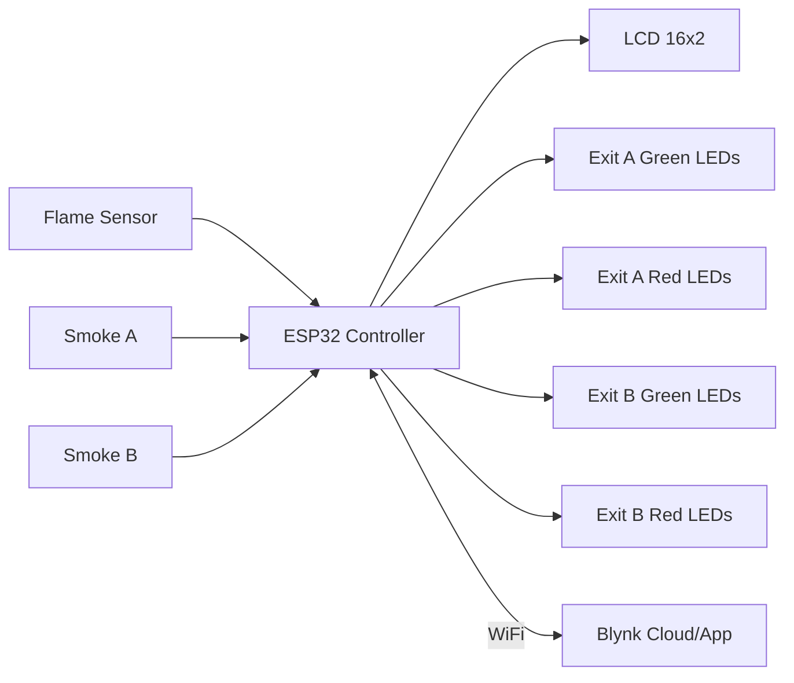

# SafePath – Intelligent Fire Evacuation System – PPT Content

Use this as a structured script for your presentation slides.

---

## Slide 1 – Title

- **Title**: SafePath – Intelligent Fire Evacuation System  
- **Subtitle**: IoT‑Based Smart Exit Guidance using ESP32 + Blynk  
- **Presented by**: `<Your Team Names>`  

---

## Slide 2 – Problem Statement

- In a fire emergency, people often:  
  - Panic and choose **nearest exit**, not **safest** exit.  
  - Walk toward **smoke‑filled** or **blocked** corridors.  
  - Lack real‑time information on which path is safe.  
- Need: an **automatic system** that **senses fire/smoke** and **guides** occupants toward the **safest route**.

---

## Slide 3 – Proposed Solution

- **SafePath** monitors fire and smoke using:  
  - 1× **flame sensor** in the hall.  
  - 2× **smoke sensors** in corridors toward **Exit A** and **Exit B**.  
- When fire is detected, SafePath:  
  - Chooses which **exit is safest**.  
  - Lights **green LEDs** along the safe corridor.  
  - Lights **red LEDs** at blocked or dangerous exits.  
  - Shows clear text on **LCD**: e.g. `"Use Exit A (GREEN)"`.  
  - Sends **alerts to smartphones** using Blynk IoT.

---

## Slide 4 – System Architecture (Mermaid)



Explain each block:

- **Sensors**: capture fire and smoke data.  
- **ESP32**: runs safe‑path algorithm, drives LEDs/LCD, pushes data to Blynk.  
- **Blynk**: sends notifications and shows live sensor values to safety officers.  

---

## Slide 5 – Hardware Components

- **ESP32 DevKit** – WiFi‑enabled microcontroller.  
- **Flame Sensor** – detects direct flame/light signatures.  
- **Smoke Sensors (MQ2)** – detect smoke concentration in each corridor.  
- **Green/Red LEDs** – visual guidance for safe vs blocked paths.  
- **16x2 I2C LCD** – shows messages like `"Fire near Exit A"` and `"Use Exit B"`.  
- **Blynk IoT** – remote monitoring + push notifications.  

Show board-level block diagram or photos for each device.

---

## Slide 6 – Building Layout & Sensor Placement

Convert this ASCII to a neat diagram:

```text
        [Exit A]
           |
        SMA (Smoke A)
           |
   ===== Corridor A =====
           |
        F (Flame)
           |
   ===== Corridor B =====
           |
        SMB (Smoke B)
           |
        [Exit B]
```

- Flame sensor F: detects overall fire in the hall.  
- Smoke A/B: detect smoke blocking corridors.  
- Green LEDs placed along whichever corridor is currently safe.  
- Red LEDs at the exit doors when that exit is dangerous.

---

## Slide 7 – Safe Path Selection Algorithm

1. **Read sensors**: `flameVal`, `smokeAVal`, `smokeBVal`.  
2. Determine **fire presence**:  
   - `fireDetected = flameVal > Tflame OR smokeAVal > TA OR smokeBVal > TB`.  
3. Determine which exits are **blocked**:  
   - `exitABlocked = (smokeAVal > TA)`  
   - `exitBBlocked = (smokeBVal > TB)`  
4. Decision tree:  
   - If **no fire detected**:  
     - Both exits green, LCD: `"No Fire Detected"`.  
   - If **A blocked, B safe**:  
     - Use Exit B (shortest safe path).  
   - If **B blocked, A safe**:  
     - Use Exit A.  
   - If **both safe**:  
     - Fire near hall only → choose Exit A as default shortest.  
   - If **both blocked**:  
     - Both exits red, LCD: `"ALL EXITS BLOCKED"`, `"Wait for rescue"`.  

---

## Slide 8 – Firmware Flowchart (Mermaid)

```mermaid
flowchart TD
  S[Start] --> Init[Init ESP32, LCD, WiFi, Blynk]
  Init --> Loop[Loop]

  Loop --> Read[Read flame + smoke sensors]
  Read --> FireCheck{FireDetected?}

  FireCheck -- No --> Normal[Show normal state\nBoth exits green]
  Normal --> SendNormal[Send "No fire" to Blynk]
  SendNormal --> Loop

  FireCheck -- Yes --> BlockEval[Compute exitABlocked / exitBBlocked]

  BlockEval --> Case1{A blocked?\nB safe?}
  Case1 -- Yes --> UseB[Guide to Exit B]

  Case1 -- No --> Case2{B blocked?\nA safe?}
  Case2 -- Yes --> UseA[Guide to Exit A]

  Case2 -- No --> Case3{Both safe?}
  Case3 -- Yes --> UseA2[Fire in hall,\nUse Exit A]
  Case3 -- No --> AllBlocked[All exits blocked]

  UseB --> BlynkB[Send 'Use Exit B' msg]
  UseA --> BlynkA[Send 'Use Exit A' msg]
  UseA2 --> BlynkA2[Send 'Fire detected - Use Exit A']
  AllBlocked --> BlynkBlock[Send 'All exits blocked']

  BlynkB --> Loop
  BlynkA --> Loop
  BlynkA2 --> Loop
  BlynkBlock --> Loop
```

---

## Slide 9 – Blynk Dashboard

- Show smartphone screenshots:  
  - Label showing `"Fire near Exit A - Use Exit B"`.  
  - Gauges or values for smoke levels in both corridors.  
  - Push notification triggered by `fire_alert` event.  
- Explain how this helps **safety officers** monitor building status in real time.

---

## Slide 10 – Demo & Conclusion

- **Demo steps**:  
  1. Normal mode – no smoke/flame.  
  2. Introduce smoke near Exit A → LEDs guide to Exit B.  
  3. Introduce smoke near Exit B → system switches to Exit A.  
  4. Smoke in both corridors → both exits red, LCD warns that all exits are blocked.  
- **Key benefits**:  
  - Clear, automatic guidance during panic situation.  
  - Remote visibility via Blynk.  
  - Easy to extend to more exits and multiple floors.  


