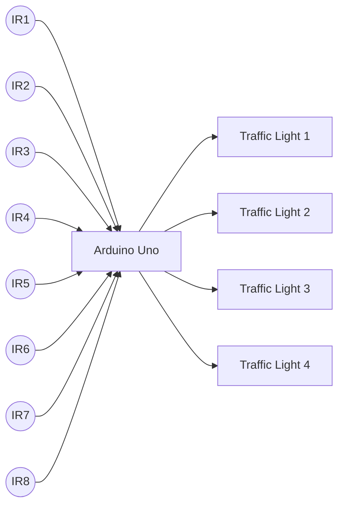
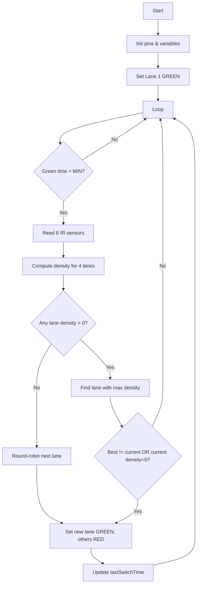

# Smart Lane-Based Traffic Light System – PPT Content

Use this as a script/outline for slides in PowerPoint, Google Slides, or Canva.

---

## Slide 1 – Title

- **Title**: Smart Lane-Based Traffic Light System  
- **Subtitle**: Density-Aware Traffic Control using Arduino Uno  
- **Presented by**: `<Your Team Names>`  

---

## Slide 2 – Problem Statement

- Traditional traffic lights use **fixed time cycles**.  
- They **waste green time** on empty lanes.  
- Result:  
  - Unnecessary waiting and fuel consumption.  
  - Congestion on busy lanes while empty lanes show green.  
- Need a **simple and low‑cost controller** that reacts to **actual vehicle presence**.

---

## Slide 3 – Proposed Solution

- A **4‑way junction controller** using **8 IR vehicle sensors** and **4 traffic lights**.  
- Each lane has **two IR sensors** to estimate vehicle density (0, 1, or 2 cars).  
- Controller always gives **green** to the lane with **highest density**.  
- If a lane has **no traffic**, its green is **skipped**.  
- All logic implemented on a single **Arduino Uno** board.

---

## Slide 4 – System Architecture (Mermaid)

Key blocks:

- **Sensors**: Detect presence/absence of vehicles per lane.  
- **Arduino**: Reads sensors, computes density, selects priority lane.  
- **Traffic Lights**: Indicate stop/go for each direction.

---

## Slide 5 – Hardware Components

- **Arduino Uno** – ATmega328P microcontroller, 14 digital I/O pins.  
- **IR Sensors (8x)** – active LOW object detection, simple digital output.  
- **Traffic Light Modules (4x)** – RED/YELLOW/GREEN indicators.  
- **Power** – 5V USB / adaptor.  
- **Breadboard/Jumpers** – prototyping connections.  

Show photos or icons of each.

---

## Slide 6 – Intersection Layout & Sensor Placement

Include the ASCII diagram converted to a clean drawing:  

- 4 approaches: **North, South, East, West**.  
- Near stop line sensor per lane (IR1/3/5/7).  
- Back sensor per lane (IR2/4/6/8) slightly behind to sense queue length.  
- Traffic light module drawn on each approach.

Explain:

- **1 sensor ON** ⇒ low density.  
- **2 sensors ON** ⇒ high density.  

---

## Slide 7 – Control Algorithm

1. **Read all IR sensors** (digital).  
2. For each lane:
   - `density = near_present + back_present`.  
3. If all densities = 0 → round‑robin to avoid starvation.  
4. Else:
   - Select lane with **maximum density** as `bestLane`.  
5. Keep current lane green for **at least 5s** (`MIN_GREEN_TIME`).  
6. After 5s, every 1s:  
   - If current lane empty OR `bestLane` changed → switch green.  
7. Always ensure conflicting lanes stay **RED**.

---

## Slide 8 – Firmware Flowchart (Mermaid)

---

## Slide 9 – Results & Demo

- Show video or photos of junction model.  
- Demonstrate scenarios:
  - All lanes empty → lights rotate.  
  - One lane heavy → that lane stays green longer.  
  - Empty lane never gets unnecessary green.  
- Mention power consumption and simple cost estimate.

---

## Slide 10 – Conclusion & Future Work

- **Conclusion**:  
  - Simple density‑based controller reduces waiting time & improves flow.  
  - Easy to implement with low‑cost IR sensors and Arduino.  
- **Future Enhancements**:  
  - Add **pedestrian crossings** with push buttons.  
  - Add **wireless connectivity** to central traffic server.  
  - Use **camera / ML** for more accurate vehicle counts.

